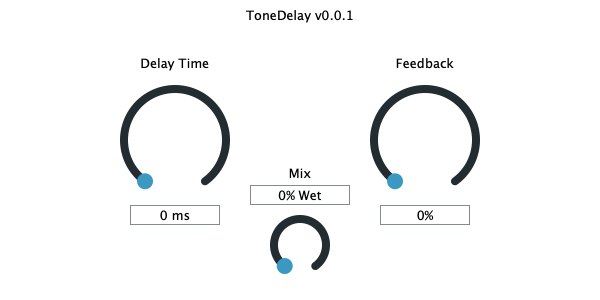

# ToneDelay

ToneDelay is the first in a suite of VST plugins created using JUCE/C++. This project is open-source, and anyone may open a PR against the repo if they wish to contribute.
This plugin is a tape-delay emulation, not based around any machine in particular, but rather imparting its own voice and style on the input. 

## Installation

For ease of use, you should install [JUCE](https://juce.com/) and use the Projucer while working on this project. I tend to use xcode when developing, but any editor that you can configure successfully should be fine.

## Usage

When you build this project from the source, you will have a `.vst` file output that you can use in your DAW of choice. JUCE also ships with the AudioPluginHost for testing your plugin in a barebones environment, as some DAWs can be finicky with detecting new plugins.

## Contributing
Pull requests are welcome. For major changes, please open an issue first to discuss what you would like to change.
